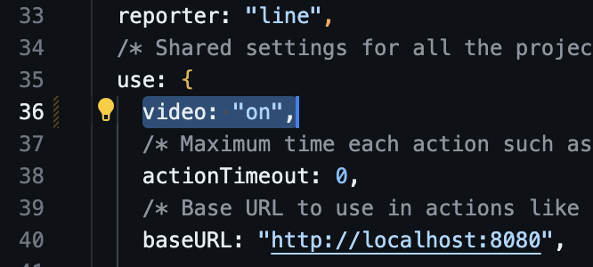
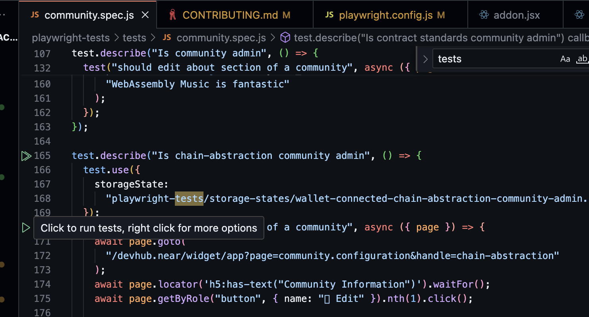

# Contribution Guidelines for DevHub Repos

## Introduction
At DevHub, we value the contributions of each individual. This document provides an overview of the developer setup and deployment process to help you contribute to our project. We also recommend familiarizing yourself with [how we work](https://github.com/near/devgigsboard-widgets/blob/main/docs/how-we-work.md) to learn about our development process and enhance your contribution experience.

## Developer Setup

You can set up everything manually as described further down, or you can use the dev container setup which has everything out of the box and will get you started quickly.

### Using a dev container

This project is configured for developing with github codespaces or a locally hosted [devcontainer](https://containers.dev/). If using one of these options you get all the dev setup you need out of the box, and you don't have to spend time on installing any dependencies.

Once your dev container is started you can run the test suite, which is a good check to verify that all is running as expected:

`npm run test:watch:codespaces`

This will give you a web interface for all the tests, and you can run them to see how everything is expected to work. You should also use the test suite when developing new functionality, as it is a much more efficient workflow for the testing and development iterations. Also it prevents future regression if you develop the test driven way.

If your work requires changes to the developer setup, you should also include and test them in the devcontainer setup so that this is always up to date.

### Prerequisites

Before you start contributing to neardevhub-widgets, ensure you have the following prerequisites installed on your machine:

- Node.js (version 18 or higher)
- [`bos` CLI](https://github.com/FroVolod/bos-cli-rs)

To familiarize yourself with the NEAR Social platform, we recommend reviewing the [NEAR Social Documentation](https://thewiki.near.page/PastPresentAndFutureOfNearSocial), since the JSX files in this repository are NEAR Social components.

You can also explore a list of [good first issues](https://github.com/near/devgigsboard-widgets/contribute) to get familiar with potential work items.

### Installation

We use `npm` and scripts in `package.json` to automate common developer tasks, so you will need NodeJS and then install project dependencies as usual:

```sh
npm install
```

### Development

#### Run the dev script

To initiate the development environment, you can use the following script. This script will start the bos-workspace environment for `devhub.near`, which you can find under the [instances](./instances/) directory.

```sh
npm run bw:dev:devhub
```

Running another instance like `events-committee.near` or `infra-structure-committee.near` can be done by the following scripts

```sh
npm run bw:dev:events
```

```sh
npm run bw:dev:infra
```

#### Customizing Creator ID, Contract ID, or Network

If you need to customize the account ID, override the contract ID, or specify a different network for your development environment, you can use the `overrides` feature of [bos-workspace](https://github.com/NEARBuilders/bos-workspace?tab=readme-ov-file#configuration).

#### Developing across multiple environments

When referencing a component or any parameter that depends on the network, please use the placeholders defined in aliases.*.json. 

`aliases.mainnet.json` - deploys main branch to mainnet @ near.org

Placeholders should be encapsulated in the ${} expression. Here is an example of a placeholder usage:

`<Widget src={homepage ?? "${REPL_ACCOUNT}/widget/ActivityPage"} />`

Placeholders are replaced with the target values specified in replacements.json when github actions deploys the components.

Feel free to specify a new placeholder if needed. The placeholder should have a REPL prefix, for example: `REPL_PROJECT_NAME`

### Deployment

#### Deploying preview environments

Creating a preview environment is often useful for reviewers to test the new features before deploying to production. Before we can deploy components, there are several replacements of global variables that needs to be made, which is handled by the BOS workspaces build command.

By running: 

```bash
npm run bw:build:devhub
```

you will get a new folder `build/devhub.near` that contains a `src` folder with all the components ready for deployment. The replacements are made according to the settings in `instances/devhub.near/aliases.mainnet.json` so you should for example change `REPL_DEVHUB` to the account name you are using for your preview environment. Note that "BOS workspaces" has a built in connection to BOS CLI for deploying with one command, but since "BOS workspaces" will output to `src/widgets` instead of `src`, and that it requires the signing key as a command argument, we have chosen to split this process in two steps using `bw build ` for replacing and preparing the deployment folder, and using `bos components deploy` separately for the deployment.

From the `build/devhub.near` folder you can use `bos components deploy`.

#### Deploy for Production

There is GitHub Actions automation that deploys all the widgets to [`devgovgigs.near` account](https://near.social/#/mob.near/widget/MyPage?accountId=devgovgigs.near) on mainnet on every push to the main branch.
Thus, once a PR is merged, you should see the new version of the widgets on [DevHub](https://neardevhub.org) in less than 15 seconds.

### Before Publishing
Before publishing, make sure that you’ve go through this section.

#### Code Style and Formatting

We use `prettier` to unify formatting. Run the following command to format your code:

```
npm run fmt
```

#### Writing tests

We use [Playwright](https://playwright.dev) for tests, which are located in the [playwright-tests](./playwright-tests/) folder. For each change or addition to the codebase you should also make sure that your changes are covered by tests in order to ensure that other developers will not break it in the future. Also you should write tests to accelerate your own development, so that you don't have to do manual coding/test interactions via the browser.

Use the [dev-container](#using-a-dev-container) setup mentioned above for getting quick access to a complete development environment with test dependencies included, or see the [test-pipeline](./.github/workflows/continuous-integration-workflow.yml) for what dependencies that needs to be installed on your workstation for tests to run.

Use the following script to run the test UI for `devhub.near` or `events-committee.near`.

```sh
npm test -- --ui
```
or
```sh
npm run test:events -- --ui
```

Currently, none of the tests post actual transactions to the smart contracts. Still you should try writing your tests so that they do the actual function call, but just skip the final step of sending the transaction. You can do this by capturing the transaction confirmation popup provided by the NEAR social VM.

Here is an example snippet to capture the VM confirmation popup:

```javascript
const transactionObj = JSON.parse(
    await page.locator("div.modal-body code").innerText()
);
```

This will parse the text contents into the javascript object that we here call `transactionObj`. You can then make assertions on the properties. See the test called "should edit a community" in [community.spec.js](./playwright-tests/tests/community.spec.js) for a full example.

##### Creating test videos

In [playwright.config.js](./playwright.config.js) there's the `use` section where you find the `video` property.

For generating test videos when you run the tests, set the `video` property to `on`:



Then run a test, the simplest is to run it using the Playwright vs code plugin:



After running you can find the video in the [test-results](./test-results/) folder.

#### Storage Deposit

Sometimes there is a need to deposit extra tokens to cover the widgets’ storage cost. You can do that with [`bos` CLI](https://github.com/FroVolod/bos-cli-rs):

```
bos social-db prepaid-storage deposit
```

NOTE: `bos` CLI will interactively ask all the rest of the details to prepare the transaction. 
