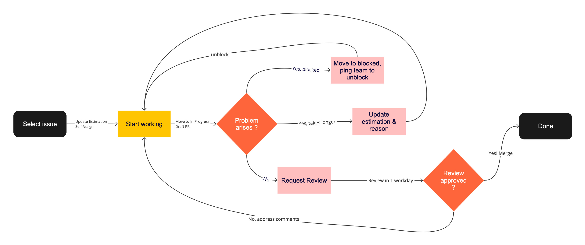

# Process for contributing to DevHub Repos

## Goal

As we have more developers working on DevHub, our top priority is to deliver impactful features to our community. We have established the following process to help our engineers work on issues more effectively across time zones.

## Agreements

Our team can succeed when each person:

* Fully owns an issue from start to finish and delivers high-quality code
* Participates on a daily basis in responding to requests and supporting each other
* Creates visibility on our progress
* Surfaces risks/blockers and works to minimize risks
* Looks beyond just the acceptance criteria to ensure we are solving the problem

## Process

Follow the workflow below when working on tasks in our DevHub repo:

### 1. **Select Issues**
    1. Pickup and assign issues from the backlog to yourself. If you don’t have permissions, leave a comment.
    2. If an issue has an estimation or the existing estimation seems off, add your estimation with one or two sentences explaining why you think it will take that amount of time.

Note: We expect you to complete your ticket within the number of days you committed. So if a ticket is ~3 days, you should be able to request a review on the third or fourth day.

### 2. **Start working** 
    1. Move the issue to “In Progress” and add the start date on our project board once you start working on it. If you don’t have permissions, leave a comment that you are moving it to in progress.
    2. Reference the issue in the PR description with “_Resolves #XX_”, so it is automatically linked, it is easy to find the prior context and expectations, and the issue will get automatically closed once PR is merged
    3. Use a draft PR to indicate that the work is not ready and you are working on it

Notes: We may reassign issues that are not in progress yet. So it is important to indicate once you start working on it. 

### 3. **Update tickets if any problems arise**
    1. If your ticket blocked:
        1. Identify blocker: Move the ticket to the blocked column, add a comment specifying the blocker, what actions you have already taken to understand and mitigate the problem, and tag the appropriate people and specify what you need.
        2. Own resolution: Add daily comments to the ticket to communicate the progress. Try to resolve the blocking ticket or find an owner for it. Once the blocker is resolved, move the ticket back to the backlog. 
    2. If your ticket takes longer than your estimation time:
        a. Add a comment specifying why the ticket is larger than your original estimate and what actions have you already taken, and what are your next steps. 
        b. Tag the Tech Lead and propose a new estimate for the amount of time you need to finish the task, along with the rationale for it. Or specify if you need someone else to take over.  Example: [https://github.com/near/neardevhub-widgets/pull/126#issuecomment-1554330035](https://github.com/near/neardevhub-widgets/pull/126#issuecomment-1554330035). 
        c. Add a daily comment to the ticket to indicate your progress.
### 4. **Request review** When you have done your work,
    1. Deploy a preview version, see how to deploy a preview version below. Once you completed your work, and provide the link in the PR description.
    2. Test the preview version to ensure everything works and meets the acceptance criteria
    3. Change the PR from draft to “ready for review”

### 5. **Review** 
    1. Another team member should review your work within one day. If you do not get a response, escalate on our Telegram channel.
    2. For reviewers: If there are no reviews by the end of your work day, please leave your review. 
    3. We require one code owner review, and in the case the reviewer has questions about the UI/UX, a review from the PM, to approve the pull request. Currently code owners are Frol and Bo, PM is Ori. In future contributors will also become code owners of different parts.

### 6. **Address review** 
    1. Address any new review comments within 2 business days
    2. Respond to each comment by either following the suggestion or providing a rationale for disagreement.
    3. Request further review from the same reviewer.
    4. Return to step 4.

### 7. **Completion**
    1. If the PR is approved, a DevHub Tech Lead squash and merge the PR and the issue is considered done.
    2. Move the issue to the “Done” column in our project board
    3. Add the end date to the issue.

## How to deploy a preview version

1. Install [https://github.com/FroVolod/bos-cli-rs](https://github.com/FroVolod/bos-cli-rs)
2. If your change is content related (need the content from DevHub mainnet to preview the changes), the preview should be deployed on mainnet
3. If your change isn’t content related, you can deploy it to testnet
4. Run `bos deposit` to deploy 1 NEAR to use it for the first deployment. This is for storage deposit.
5. Run `bos deploy` in the root directory of neardevhub-widgets repo, and follow the interactive prompt to deploy on mainnet or testnet.
6. It will print a command for you to deploy next time. Use that command it will deploy without the need to go over interactive prompts every time.
7. Should be rare, but if you’ve used up storage deposit, run `bos deploy` to deposit another 0.1 NEAR
8. To preview your deploy, use [https://near.social/#/&lt;youraccount.near>/widget/gigs-board.pages.Feed?nearDevGovGigsContractAccountId=devgovgigs.near](https://near.social/#/bo.near/widget/gigs-board.pages.Feed?nearDevGovGigsContractAccountId=devgovgigs.near) for mainnet, for example: [https://near.social/#/bo.near/widget/gigs-board.pages.Feed?nearDevGovGigsContractAccountId=devgovgigs.near](https://near.social/#/bo.near/widget/gigs-board.pages.Feed?nearDevGovGigsContractAccountId=devgovgigs.near). For testnet, it’s [https://test.near.social/](https://test.near.social/)&lt;youraccount.testnet>/widget/gigs-board.pages.Feed. You will also need to deploy a copy of [neardevhub-contracts](https://github.com/near/neardevhub-contract) to &lt;youraccount.testnet>.

# Quick Reference

